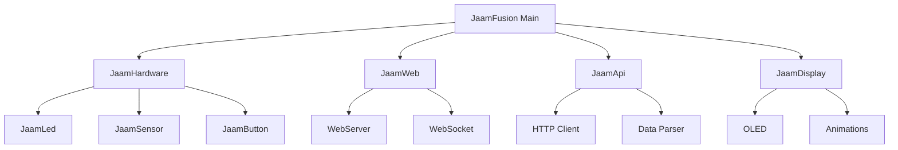
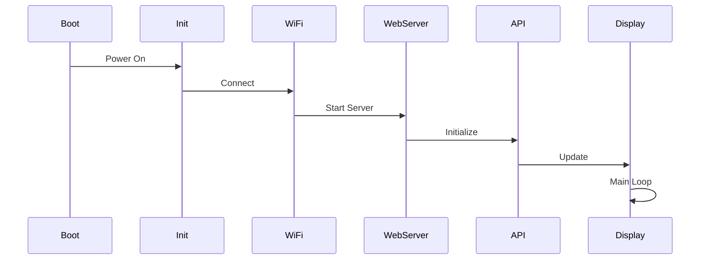

# Архітектура проєкту

Огляд архітектури JAAM Fusion 5.x.

## Загальна структура

JAAM Fusion побудований на модульній архітектурі, де кожен компонент відповідає за певну функціональність.



## Основні модулі

### JaamHardware
Управління апаратними компонентами:
- LED стрічка
- OLED дисплей
- Сенсори (BME280, BH1750)
- Кнопки

### JaamWeb
Веб-інтерфейс та API:
- AsyncWebServer
- WebSocket сервер
- REST API endpoints
- Статичні файли

### JaamApi
Інтеграція з зовнішніми API:
- JAAM Server WebSocket
- Alerts API
- Weather API
- NTP синхронізація

### JaamDisplay
Відображення даних:
- OLED інтерфейс
- LED анімації
- Індикація станів

### JaamConfig
Управління налаштуваннями:
- Читання/запис EEPROM
- JSON конфігурація
- Валідація параметрів

## Файлова структура

```
src/
├── JaamFusion.cpp          # Main entry point
├── JaamHardware.cpp/h      # Hardware abstraction
├── JaamLed.cpp/h          # LED control
├── JaamDisplay.cpp/h       # OLED display
├── JaamWeb.cpp/h          # Web server
├── JaamApi.cpp/h          # API client
├── JaamConfig.cpp/h        # Configuration
├── JaamStorage.cpp/h       # EEPROM/SPIFFS
├── JaamButton.cpp/h        # Button handler
├── JaamSensor.cpp/h        # Sensors
└── JaamUtils.h            # Utilities
```

## Потоки виконання (FreeRTOS Tasks)

### Main Task
- Ініціалізація системи
- Головний цикл обробки

### WebServer Task
- Обробка HTTP запитів
- WebSocket connections

### API Task
- Отримання даних з API
- Парсинг та кешування

### Display Task
- Оновлення OLED
- LED анімації

## Управління пам'яттю

### Flash Memory (4MB)
- **Program**: ~1.5MB
- **SPIFFS**: ~1MB (web assets)
- **OTA**: ~1.5MB (для оновлень)

### RAM (520KB)
- **Heap**: ~200KB вільно
- **Stack**: ~50KB
- **Static**: ~100KB

### EEPROM (512 bytes)
- Налаштування WiFi
- LED маппінг
- Користувацькі параметри

## Життєвий цикл



## Патерни проєктування

### Singleton
Використовується для глобальних компонентів (Config, Hardware).

### Observer
Events для сповіщень між модулями.

### Factory
Створення різних типів анімацій та режимів.

## Залежності

### Основні бібліотеки
- **Arduino Core for ESP32**
- **AsyncTCP**
- **ESPAsyncWebServer**
- **ArduinoJson**
- **Adafruit_GFX** / **U8g2** (для OLED)
- **FastLED** / **NeoPixelBus** (для LED)

### Опціональні
- **BME280** (сенсор)
- **BH1750** (сенсор)
- **ESP32Ping** (network diagnostics)

## Конфігурація збірки

Дивіться [platformio.ini](https://github.com/J-A-A-M/jaam_fusion/blob/main/platformio.ini) для деталей.

## Для розробників

- [UI Контроли](controls-guide.md)
- [Web Assets](web-assets.md)
- [Збірка проєкту](building.md)
- [Contribution Guide](contributing.md)
