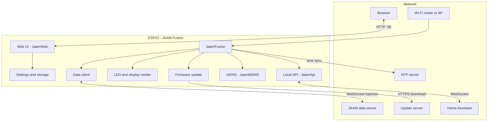
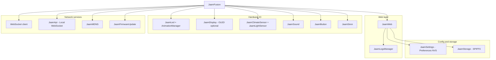
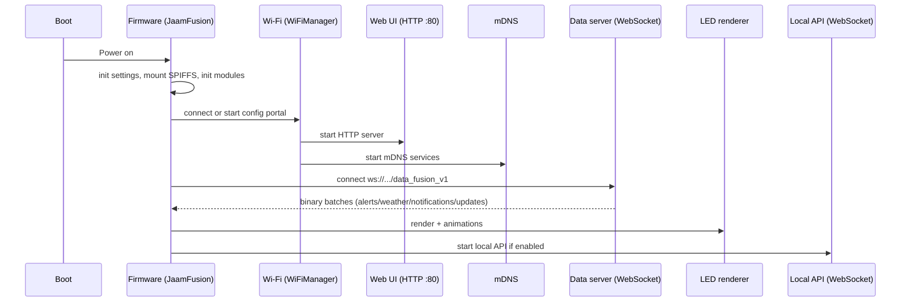

# Архітектура проєкту

Цей розділ описує **фактичну** архітектуру JAAM Fusion 5.x за поточним кодом у `src/` і узгоджено з документацією веб‑інтерфейсу.

## Картина цілком

JAAM Fusion — це прошивка для ESP32, яка:

- підключається до Wi‑Fi (через WiFiManager)
- піднімає веб‑інтерфейс (HTTP сервер на порту 80)
- підключається до **серверу даних** через WebSocket і отримує бінарні батчі (тривоги/погода/нотифікації/оновлення)
- рендерить стан на LED‑стрічки та (опційно) на OLED
- може підняти **локальний WebSocket API** (на окремому порту) для інтеграцій на кшталт Home Assistant

### Модулі прошивки (детальніше)

Ця діаграма показує “внутрішні” блоки без мережевого шару.

## Основні модулі (що за що відповідає)

### `JaamFusion`

Це “диригент” прошивки:

- ініціалізує підсистеми
- тримає головний цикл і викликає `...Process()` (Wi‑Fi, дисплей, яскравість, WebSocket, API клієнти)
- обробляє батчі з серверу даних і запускає рендер/анімації

### `JaamWeb` (веб‑інтерфейс)

Піднімає HTTP сервер на порту 80 і обслуговує:

- динамічну UI‑сторінку `/` (рендериться з **UI schema**)
- панелі даних для UI:
  - `/system-info`
  - `/alerts-info`
  - `/logs-info`
- UI schema endpoints:
  - `/ui-schema/models`
  - `/ui-schema/sections`
  - `/ui-schema/controls`
  - `/ui-schema/controls/values`
  - `/ui-schema/dropdown_lists`
- редактори та їх дані:
  - `/map-editor`, `/map-data`, `/save-map`
  - `/bg-color-editor`, `/bg-colors-data`, `/save-bg-colors`
- керування налаштуваннями:
  - `/settings/backup`
  - `/settings/restore`
  - `/settings/reset`

!!! note
        Для “мутаційних” запитів (збереження/скидання) у прошивці є перевірка походження запиту (Referer/Host) — це важливо, коли ви описуєте автоматизації або інтеграції.

Детальніше про UI: [Налаштування](../web-interface/settings.md).

### `JaamSettings` (налаштування)

Налаштування зберігаються в **Preferences (NVS)**, а не в EEPROM.

Ключові особливості:

- кожна опція має тип (`int/string/float`) і ключ
- є валідація (наприклад, заборона `API_PORT = 80`)
- є callback на зміну налаштувань: модулі (mDNS/API/сирена тощо) можуть реагувати на зміни

### `JaamStorage` (файлова система)

Для файлів використовується **SPIFFS**. Ключові дані:

- `/custom_map.json` — власна карта LED
- `/bg_led_colors.json` — індивідуальні кольори фонової стрічки

Це узгоджується з:

- [LED Mapping](../hardware/led-mapping.md)
- [Редактор мапи](../web-interface/map-editor.md)
- [Редактор кольорів](../web-interface/color-editor.md)

### Мережевий шар: WebSocket сервер даних

Прошивка підключається до серверу даних за адресою `ws://<WS_SERVER_HOST>:<WS_SERVER_PORT>/data_fusion_v1`.

Дані приходять як **бінарні батчі** різних типів:

- тривоги (повний стан)
- нотифікації (короткі події для анімацій)
- погода (температура)
- інформація про доступні оновлення прошивки (prod/beta)

### `JaamApi` (локальний WebSocket API для інтеграцій)

Це не “клієнт зовнішніх API”. Це **локальний WebSocket сервер**, який запускається лише якщо увімкнено:

- **Мережа → Увімкнути API (WebSocket)**
- **Мережа → Порт API (WebSocket)** (типово `81`)

API:

- при підключенні віддає initial state
- надсилає broadcast‑події (стан тривоги/температура/системна інформація/наявність оновлення)
- приймає керувальні команди (режими мапи/дисплею, лампа, home region, night mode, запит OTA тощо)

Детальніше: [Home Assistant](../api/home-assistant.md) та [Мережа](../web-interface/sections/network.md).

### `JaamMDNS`

mDNS публікує:

- HTTP сервіс для веб‑інтерфейсу (`_http._tcp`)
- сервіс `_jaam-ws._tcp` (instance name = “Назва пристрою”), якщо увімкнено локальний API

Hostname для `.local` задається параметром **Мережа → Ім'я в мережі**.

### Рендеринг: `JaamLed` + `AnimationManager`

Робота зі стрічками базується на **Adafruit NeoPixel**.

Важливі принципи:

- є логічні канали: **основна (main)**, **фонова (bg)**, **сервісна (service)**
- анімації керуються менеджером, який має власні стани LED і механізми синхронізації
- в коді є обмеження розмірів (наприклад, `MAX_LEDS_STRIP_MAIN`, `MAX_LEDS_STRIP_BG`)

### `JaamDisplay`

OLED‑дисплей опційний. Реалізація — через **U8g2**, із автоперевіркою I2C та підтримкою кількох моделей.

Детальніше:

- [OLED Дисплей](../hardware/oled-display.md)
- [Дисплей](../web-interface/sections/display.md)

### Сенсори

У прошивці є окремі модулі:

- `JaamClimateSensor` (BME/BMP, SHT2x/SHT3x, AHT2x/AHT3x)
- `JaamLightSensor` (BH1750)

Детальніше: [Сенсори](../hardware/sensors.md).

### Оновлення: `JaamFirmwareUpdate`

Поточна архітектура оновлень:

1. Список доступних версій надходить із серверу даних у WebSocket‑батчах.
2. Завантаження оновлення відбувається по HTTPS з `update.jaam.net.ua`.
3. Прогрес оновлення показується на дисплеї та може broadcastитися через локальний API.

Детальніше: [Оновлення прошивки](../web-interface/sections/firmware.md).

## Життєвий цикл (спрощено)

## Конкурентність і таймери

Проєкт використовує `Async` (таймери/відкладені виклики) та мʼютекси (наприклад, для безпечних операцій зі стрічками/анімаціями). Це важливіше для розуміння поведінки, ніж “набір окремих FreeRTOS задач”.

## Залежності (збірка)

Актуальний список — у `platformio.ini`. Ключові бібліотеки, які використовуються в коді:

- Arduino Core for ESP32
- WiFiManager
- WebServer (вбудований у Arduino core)
- ArduinoWebsockets
- ArduinoJson
- U8g2 (OLED)
- Adafruit NeoPixel (LED)
- NTPtime
- OneButton
- ESP32-targz (стиснення JSON/HTML відповідей)

Також: forcedBMX280, SHTSensor, AHTxx, BH1750_WE, melody-player, DFRobot_DF1201S.

## Для розробників

- [UI Контроли](controls-guide.md)
- [Web Assets](web-assets.md)
- [Збірка проєкту](building.md)
- [Contribution Guide](contributing.md)
