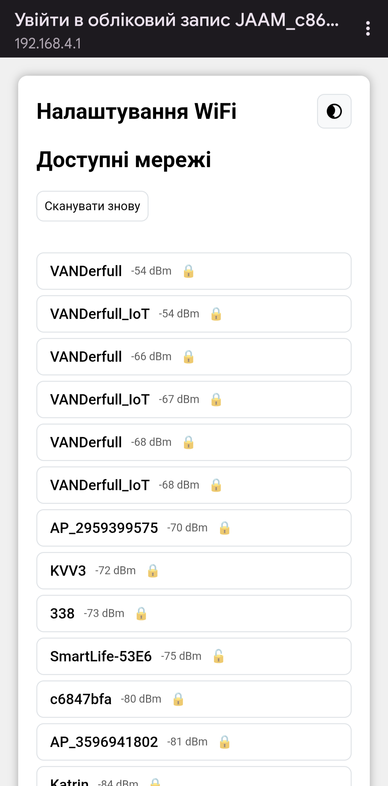
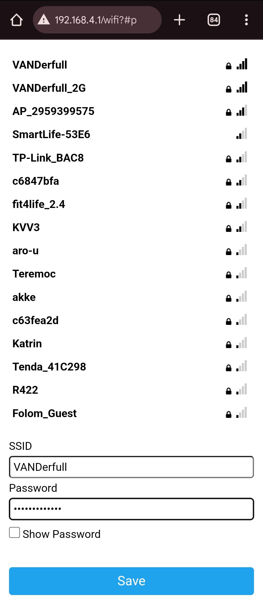

# Перша конфігурація

Після встановлення прошивки необхідно виконати початкові налаштування.

## Підключення до WiFi

### Режим Access Point

При першому запуску пристрій створює власну WiFi мережу:

- **SSID**: `JAAM_XXXXXX` (де XXXXXX — частина MAC-адреси)
- **Пароль**: Немає (відкрита мережа)

    { width="500" }

    *На дисплеї відображається назва WiFi мережі та IP-адреса*

{ width="500" }

### Налаштування WiFi

1. Підключіться до мережі `JAAM_XXXXXX` (без пароля)
2. Відкрийте `http://192.168.4.1`

    { width="400" }

    *Портал налаштування WiFi автоматично відкриється після підключення*

3. Натисніть **Configure WiFi**, оберіть свою мережу зі списку та введіть пароль

    { width="400" }

    *Оберіть мережу зі списку та введіть пароль*

4. Натисніть **Save** — пристрій збереже налаштування і перезавантажиться

    { width="500" }

    *Підтвердження збереження на дисплеї*

!!! success "✅ Готово до використання"
    Після налаштування WiFi пристрій готовий до використання з базовими налаштуваннями. Решта налаштувань є необов'язковими.

### Доступ до сторінки налаштувань

Після перезавантаження пристрій підключиться до вашої мережі. Щоб отримати доступ до веб-інтерфейсу налаштувань:

1. Відкрийте браузер
2. **Рекомендовано**: Знайдіть IP-адресу пристрою в налаштуваннях маршрутизатора та перейдіть на `http://<ip-адреса>`
3. Альтернативно: Спробуйте `http://jaam_xxxxxx.local` (де XXXXXX — частина MAC-адреси з назви WiFi мережі)
4. Ви потрапите до головної сторінки веб-інтерфейсу

    { width="500" }

    *IP-адресу можна побачити на дисплеї при завантаженні*

!!! tip
    Якщо пристрій не може підключитись до збереженої мережі (наприклад, при переміщенні в нове місце), він автоматично створить власну WiFi мережу `JAAM_XXXXXX` для повторного налаштування.

## Додаткові налаштування

### Домашній регіон

Домашній регіон потрібен, щоб пристрій розумів, для якого регіону показувати **сповіщення про тривоги та інші небезпеки** (наприклад, для анімацій/звуку/сирени, прив’язаних до вашого регіону).

Перейдіть: **Загальні → Домашній регіон**

Оберіть свій регіон зі списку та збережіть налаштування.

### Часовий пояс

Перейдіть: **Загальні → Часовий пояс**

Налаштуйте часовий пояс, якщо він відмінний від `Europe/Kyiv`.

### Яскравість

Перейдіть: **Яскравість → Режим яскравості**

Для ручного керування оберіть **"Вимкнено"** і встановіть **"Загальна"** на потрібному рівні.

Якщо хочете автоматичне регулювання — оберіть **"День/Ніч"** або **"Сенсор освітлення"** і налаштуйте рівні яскравості для **"День"** та **"Ніч"**.

### Звук

Перейдіть: **Звук → Джерело звуку**

1. Оберіть **"Джерело звуку"** (або вимкніть звук, якщо він не потрібен)
2. Встановіть **"Гучність мелодії вдень"** та **"Гучність мелодії вночі"**
3. За потреби налаштуйте нічну поведінку:
    - **"Вимикати всі звуки у нічний час"**
    - **"Звукові сигнали тривоги у нічний час"**
4. Увімкніть звукові події, які вам потрібні:
    - **"Звукове сповіщення при тривозі у домашньому регіоні"**
    - **"Звукове сповіщення при скасуванні тривоги у домашньому регіоні"**
    - **"Звукове сповіщення при загрозі ударних БПЛА"**, **"Звукове сповіщення при розвідувальних БПЛА"**
    - **"Звукове сповіщення при загрозі крилатих та авіаційних ракет"**, **"Звукове сповіщення при загрозі КАБ"**, **"Звукове сповіщення при загрозі балістики"**
    - **"Звукове сповіщення при вибухах"**

!!! note
    Списки мелодій (наприклад, **"Мелодія при тривозі у домашньому регіоні (буззер)"**) з’являються лише якщо вибрано джерело звуку та увімкнено відповідне звукове сповіщення.

## Анімації та кольори подій

У прошивці можна окремо налаштувати **анімацію** та **колір** для різних типів подій (наприклад, початок/відбій тривог, БПЛА, ракети, вибухи тощо).

### Увімкнення типів подій

Перейдіть: **Тривоги**

Тут можна увімкнути/вимкнути відображення окремих подій:

- **Загроза КАБ**
- **Загроза крилатих та авіаційних ракет**
- **Загроза ударних БПЛА**
- **Розвідувальні БПЛА**
- **Загроза балістичних ракет**
- **Вибухи**

### Налаштування анімацій

Перейдіть: **Анімації**

!!! note
    Налаштування для подій (БПЛА/ракети/вибухи/КАБ тощо) відображаються в цьому розділі лише тоді, коли відповідний тип події увімкнений у розділі **Тривоги**.

1. За потреби увімкніть **"Синхронні анімації"**
2. За потреби увімкніть **"Попередній перегляд анімацій"**
3. Оберіть тип анімації для кожної події (випадаючі списки з назвами подій):
    - **Початок тривог**, **Відбій тривог**
    - **Загроза ударних БПЛА**, **Розвідувальні БПЛА**
    - **Загроза крилатих та авіаційних ракет**, **Загроза КАБ**
    - **Загроза балістичних ракет**, **Вибухи**
4. За потреби відрегулюйте:
    - **Налаштування тривалості показу анімацій (в секундах)**
    - **Налаштування тривалості одного циклу анімації (в мілісекундах)**

### Налаштування кольорів

У цьому ж розділі відкрийте блок **"Налаштування кольорів"** і задайте кольори для потрібних подій (наприклад, **"Початок тривог"**, **"Відбій тривог"**, **"Загроза ударних БПЛА"**, **"Вибухи"**), а також для елементів **"Домашній регіон"**, **"Задня підсвітка"**, **"Режим лампи"**.

## Що далі?

- [Налаштування](../web-interface/settings.md)
- [Тривоги та сповіщення](../features/air-alerts.md)
- [LED Mapping](../hardware/led-mapping.md)
- [Підключення сенсорів](../hardware/sensors.md)
