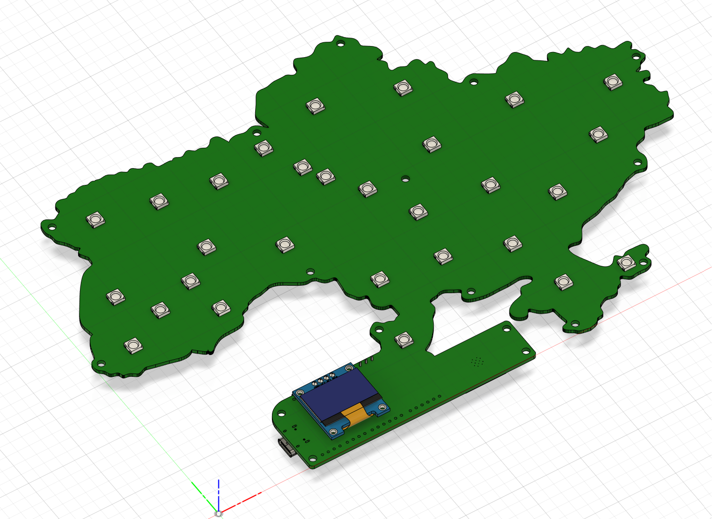
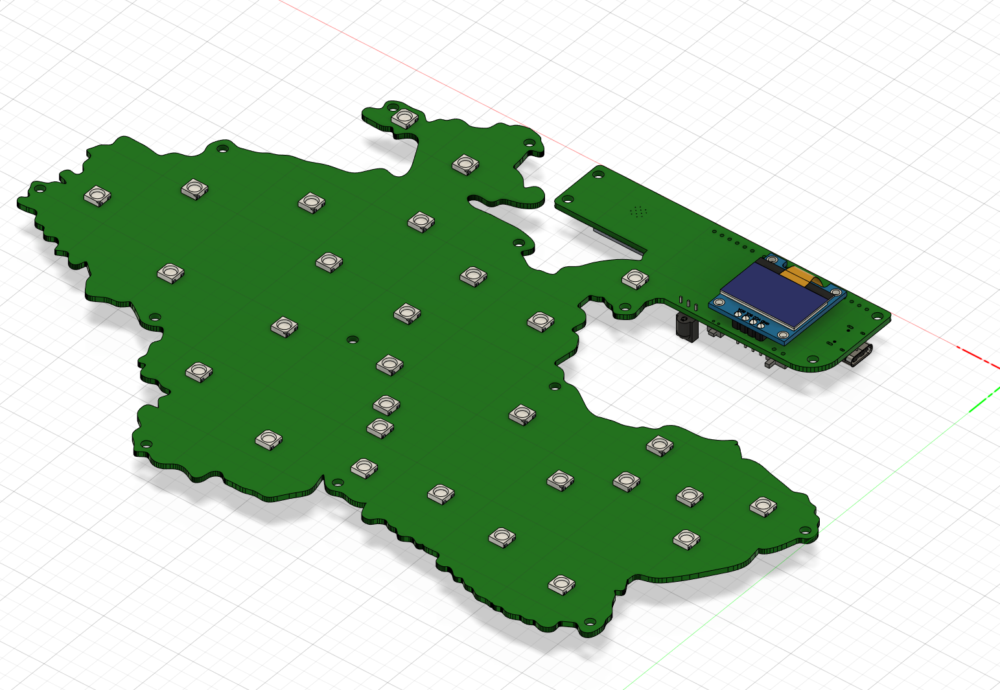
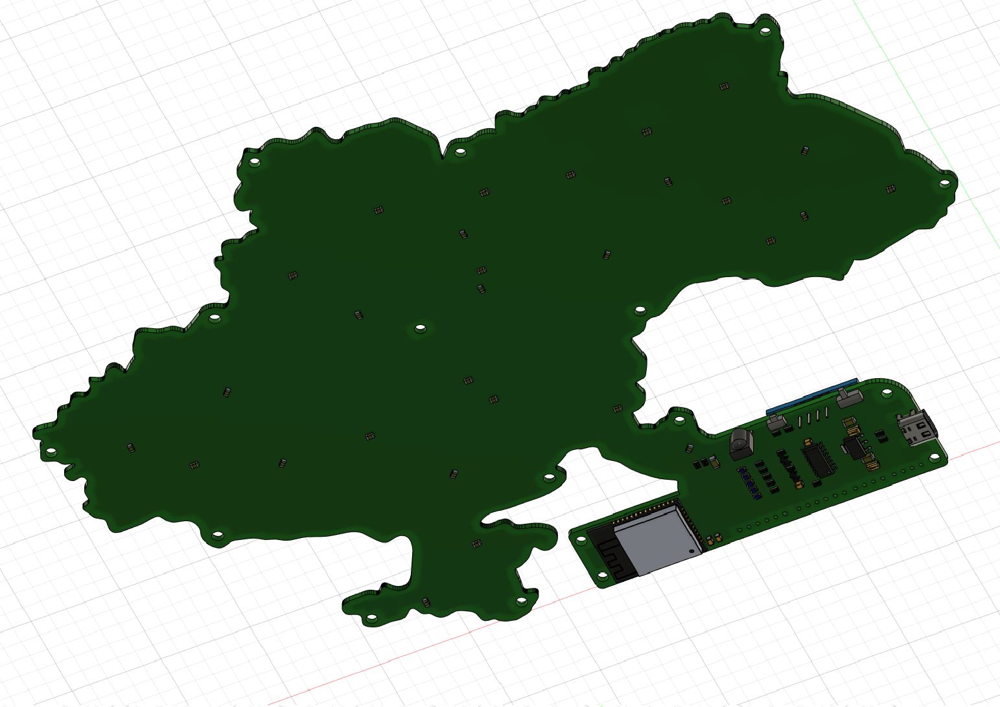
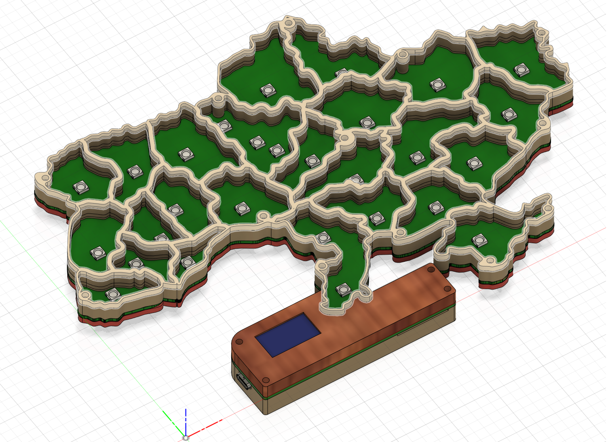

# JAAM 1.3

Ця сторінка описує плату **JAAM 1.3** і те, як вона представлена в прошивці **JAAM Fusion** (апаратний профіль).

## Фото

## Профіль у JAAM Fusion

Щоб увімкнути готовий апаратний профіль:

- Перейдіть: **Загальні → Режим прошивки**
- Оберіть: **Плата JAAM 1.3**

Дивіться також: [Загальні](../web-interface/sections/general.md).

### Зафіксовані параметри (у профілі)

Ці параметри задаються прошивкою автоматично (на основі обраного профілю):

- **Основні LED**: GPIO **13**, кількість **26**
- **Фонова підсвітка**: вимкнено
- **Сервісні LED**: вимкнено
- **Кнопки**:
  - Button 1: GPIO **35**
  - Button 2: вимкнено
  - Button 3: вимкнено
- **OLED-дисплей**: **SSD1306**, висота **64**, поворот **0°**

## Опис плати

- Текстолітова плата у формі України.
- Фронтальна частина: 29 світлодіодів **WS2812B** (описано як одна лінія з паралельними гілками на 1-му, 17-му та 25-му світлодіодах) та дисплейний модуль **SSD1036** з екраном 128×64.
- Конектор живлення і прошивки: **USB Type-C**.
- На задній частині: модуль ESP32, перемикач живлення, кнопка керування, ІЧ-приймач (для майбутнього функціоналу).
- Виведені піни ESP32: 6, 7, 8, 9, 10, 23, 32, 33, 34, RX, TX; також виведені 3.3V і 5V.
- Виведені 5 мікродіодів для індикації режимів роботи.
- Розміри: 17×25 см; є отвори для кріплення корпусу.
