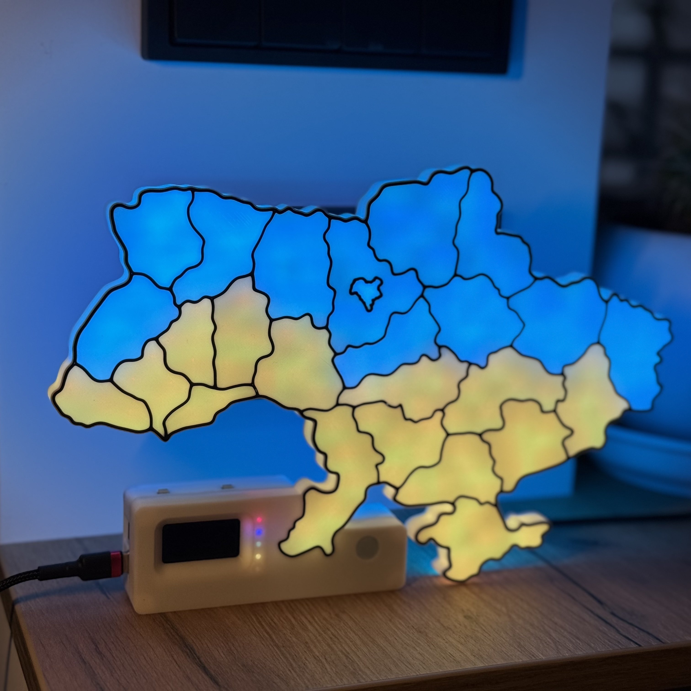
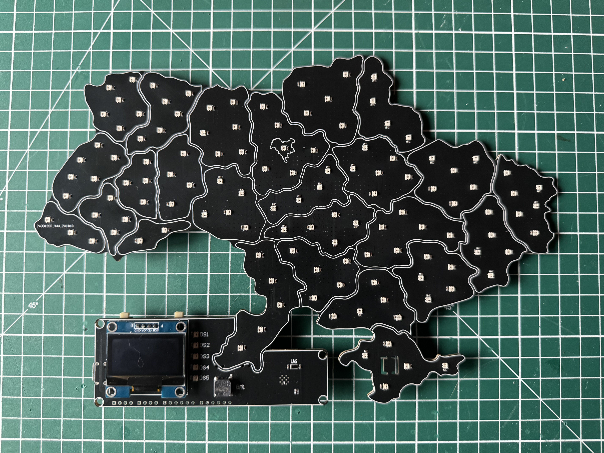
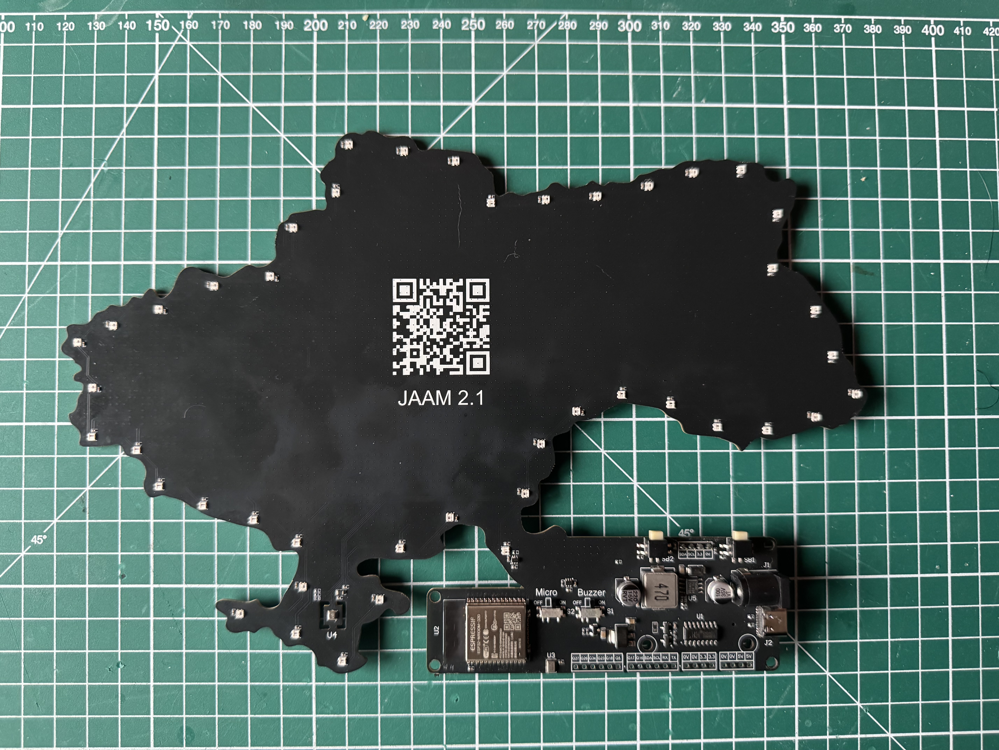

# JAAM 2.1

Ця сторінка описує плату **JAAM 2.1** і те, як вона представлена в прошивці **JAAM Fusion** (апаратний профіль).

## Фото

## Профіль у JAAM Fusion

Щоб увімкнути готовий апаратний профіль:

- Перейдіть: **Загальні → Режим прошивки**
- Оберіть: **Плата JAAM 2.1**

Дивіться також: [Загальні](../web-interface/sections/general.md).

### Зафіксовані параметри (у профілі)

Ці параметри задаються прошивкою автоматично (на основі обраного профілю):

- **Основні LED**: GPIO **13**, кількість **26**
- **Фонова підсвітка**: GPIO **12**, кількість **44**
- **Сервісні LED**: GPIO **25**, кількість **5**
- **Кнопки**:
  - Button 1: GPIO **4**
  - Button 2: GPIO **2**
  - Button 3: вимкнено
- **Buzzer**: GPIO **33**
- **OLED-дисплей**: **SH1106G**, висота **64**, поворот **0°**

!!! note
  Для профілю **Плата JAAM 2.1** прошивка має особливість роботи із сенсором освітлення BH1750 (активація через GPIO19). Детальніше: [Сенсор освітлення](../hardware/sensors/light-sensor.md).

## Опис плати

- Фронтальна частина: 124 LED **WS2812B-2020** (по 2–6 LED на область, Київ — 1 LED).
- OLED-дисплей **SH1106G** (1.3") для годинника/температури та іншої інформації.
- 5 сервісних LED для індикації системних подій; один LED зарезервовано під майбутній функціонал.
- Сенсор освітлення **BH1750**.
- Динамік (buzzer) та фізичний вимикач (світч) буззера.
- Задня частина: 44 LED фонової підсвітки (ambient light).
- Сенсор клімату **BME280**.
- ESP32 та мікрофон **ICS-43432** (як резерв під майбутній функціонал) з апаратним вимикачем.
- Дві кнопки керування (режими/перезавантаження/перепрошивка тощо).
- Виводи незадіяних пінів ESP32 та I2C.
- Живлення: **USB Type-C** або **DC 5.5×2.1** (5–24V).

!!! tip
  Якщо звуку немає — перевірте положення фізичного вимикача буззера та налаштування звуку. Детальніше: [Buzzer](../hardware/sound/buzzer.md).
